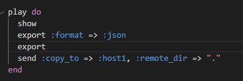
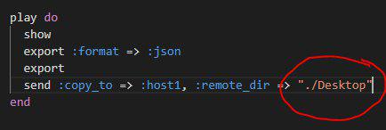

[<< back](../../README.md)

1. [Description](#description)
2. [Usage](#usage)
3. [Parameters](#parameters)
4. [Send several reports](#send-several-reports)

## Description

`send` is used to copy Teuton reports into remote machines.

## Usage

```ruby
start do
  export
  send :copy_to => :host1
end
```

* `send` instruction must be execute after `export`. Reports must be generated before send them, of course.
* `host1`, it' the label that identified remote host. This information must be configured into config file.
* `send copy_to: :host1`, copy every case resport file into temp directory on remote host `host1`.

## Example

Example 1: send `case-01-txt` file to remote Windows host.




Example 2: send report file to remote "./Desktop" folder.



## Parameters

| Action | Description |
| ------ | ----------- |
| `send copy_to: :host1, remote_dir: "/home/david"` | Reports will be saved into "/home/david" directory in remote machine `host1`. |
| `send copy_to: :host1, prefix: "samba_"` | Case report will be save into temp directory on every host `host1`, named as `samba_case-XX.txt`. |

> Teuton version 2.0.x
> * By default, `send` only works when remote OS type is UNIX base, like GNU/Linux, MACOS, BSD, etc.
> * For Windows OS we must specified `:remote_dir`. Example: `send :copy_to => :host1, :remote_dir => "C:\\"`. This example will copy files on directory c:\ of host1 machine.

## Send several reports

If you export several files using differents output formats, you will use several `export` orders. Then when invoke `send` order, this will send the last exported file.

In this example we export html and txt files, but only send txt to remote hosts:

```ruby
start do
  export format: :json
  export format: :txt

  send copy_to: :host1
end
```

If you want to send every exported output file, then do like this:

```ruby
start do
  export format: :html
  send copy_to: :host1

  export format: :txt
  send copy_to: :host1
end
```
