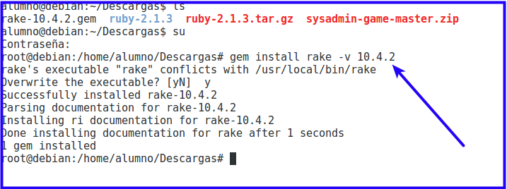

# Instalación en el equipo del profesor con Debian 8.6

A continuación se muestra cómo realizar la instalación del programa
*sysadmin-game* en la máquina principal o del profesor con el sistema
operativo Debian 8.

Tenemos dos formas de hacerlo:
1. Usar las versiones predeterminadas por nuestra instalación.
1. Usar las versiones más avanzadas, compilando directamente el código fuente.

---

# 1. Instalación estándar

> Cuando se muestre el comando precedido de `#` indica que debemos ejecutar
el comando como usuario `root`.

* `# apt-get install -y git`, para instalar git.
* `git clone https://github.com/dvarrui/teuton.git`, para descargar este proyecto.

> Ejemplo de clonación usado comandos `git`:
> 

* `cd teuton`, entrar dentro de la carpeta del proyecto.
* `# apt-get install -y ruby`, para instalar ruby.
    * `ruby -v`, para comprobar que la versión instalada >= 2.1.3.
* `# gem install rake`para instalar rake.
    * `rake --version` para comprobar que la versión instalada =>10.4.2.

> Es importante que nos aseguremos de instalar rake como gema y no como paquete del sistema.

* `# rake debian`, para instalar las gemas necesarias en nuestro sistema.

> Error que se produce cuando tenemos una versión incorrecta de `ruby`:
> 

* `./teuton -v`, para comprobar se ejecuta el proyecto.
* `rake check`, para comprobar que está todo bien instalado.

¡Ya lo tenemos!

---

# 2. Instalación descargando las últimas versiones

```
Autor: Manuel Martínez Carbonell
```

## 2.1 Instalar Ruby

A la hora de instalar Ruby tenemos varias opciones:
* Usar el sistema de gestión de paquetes de la propia distribución.
* Usar instaladores, manejadores para poder cambiar entre distintas versiones de Ruby en el sistema y,
* Compilar el código fuente.

> Enlace para obtener [más información sobre la instalación](https://www.ruby-lang.org/en/documentation/installation/)

En esta sección se muestra cómo hacerlo compilando el código fuente.

> * El proyecto está testado para ruby 2.1.3, por lo debe funcionar para versiones superiores
> * Recomendaría instalar desde el código fuente cuando la versión de ruby fuera
menor a 2.1.3. En caso contrario con `apt-get install ruby` tenemos.

* Primero nos aseguramos de tener instaladas las siguientes librerías antes de continuar:
```
# apt-get install zlib1g-dev
# apt-get install libssl-dev
```
* Luego descargamos la versión necesaria de Ruby, se descomprime el archivo.
    * [Descargar ruby 2.1.3](https://www.ruby-lang.org/en/news/2014/09/19/ruby-2-1-3-is-released/)
    * Ruby ya va por una versión posterior a la 2.1.3.
* Dentro del directorio se ejecuta:
```
$ ./configure
$ make
# make install
```


> * Este es el proceso estándar para compilar código fuente.
> * Enlace sobre [más información sobre la instalación de Ruby](https://www.ruby-lang.org/es/documentation/installation/#building-from-source)

* Comprobamos la versión de Ruby con `# ruby -v`


## 2.2 Instalación de rake

* Puedes descargar la [versión 10.4.2 de rake](https://rubygems.org/gems/rake/versions/10.4.2?locale=es).
* En el directorio donde hayas descargado rake se debe ejecutar: `# gem install rake -v 10.4.2`



> Creo que el comando `gem install rake -v 10.4.2` instala descargando la gema
directamente desde los repositorios de internet, y no usa lo ficheros descargados.

* Comprobar la versión de rake con: `$ rake --version`


## 2.3 Descargar el proyecto Sysadmin-game

* Descargar y descomprimir el proyecto.
* Entrar el directorio `sysadmin-game-master`.
* Ejecutar `rake install_gems` para que se instalen el resto de las gemas necesarias en nuestro sistema.


> Error que se produce cuando tenemos una versión incorrecta de ruby:
>
> 
>
> Las gemas (librerías de ruby) que se usan, necesitan una versión de ruby
superior a 2.0
> `net-ssh` es la gema que permite la conexión SSH entre las máquinas.

##2.4 Posibles inconvenientes

Tras la instalación de Ruby, al intentar instalar rake puede que se produzca el siguiente error:


Para solucionar el error anterior se deben instalar los siguientes paquetes:
```
# apt-get install zlib1g-dev
# apt-get install libssl-dev
```

En caso de que no se instale la librería `libssl-dev`, se obtendría el siguiente
error al intentar instalar `rake`:


Cuando se hayan instalado los dos paquetes anteriores hay que recompilar Ruby
(previamente se debe ejecutar un `make clean`):
```
$ make clean
$ ./configure  > Este paso no es necesario
$ make
# make install
```
Ahora si que se podrá instalar rake sin problemas: `# gem install rake -v 10.4.2`


